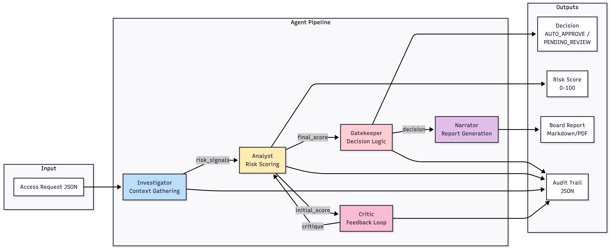

<table width="100%" style="width: 100%; border-collapse: collapse; border: none; margin: 0; padding: 0;">
  <tr>
    <td align="left" valign="middle" style="border: none; padding: 10px;">
      <h1 style="margin: 0;">🛡️ AccessOps Intelligence</h1>
    </td>
    <td align="right" valign="middle" style="border: none; padding: 10px;">
      
    </td>
  </tr>
</table>


### A Multi-Agent ADK System for Real-Time Access Risk Governance in Enterprise Cloud Environments

---

## 📌 Overview

**AccessOps Intelligence** is a multi-agent risk adjudication engine built with the **Google Agent Development Kit (ADK)** and **Gemini 1.5 Flash**.

It governs real-time access requests from **Non-Human Identities (NHIs)** such as AI agents, service accounts, and automation bots — which now outnumber human identities 10:1 in modern cloud infrastructures.

The system replicates the reasoning workflow of a Security Operations Center (SOC):  
investigate → quantify → critique → enforce → report.

It is deployed as a full **CISO Command Center UI** using Streamlit, with:

- Live multi-agent reasoning trace  
- NIST 800-53 aligned risk scoring  
- Deterministic gatekeeper logic  
- Board-ready PDF report generation  
- Custom JSON scenario builder  
- Architecture diagrams integrated directly in the UI  

---

📌 **High Level Architecture Diagrams**

**Architecture Diagram:** [data_flow.png](data_flow.png)

**Agent Sequence (Toxic Scenario):** [agent_sequence_toxic.png](agent_sequence_toxic.png)

**Gatekeeper Logic:** [Gatekeeper_logic.png](Gatekeeper_logic.png)

---

## 🚨 The Problem: “Context Blindness” in Traditional Access Governance

Legacy Identity Governance tools rely on static, binary rules:

- "If role = admin → deny"  
- "If service account → allow"  
- "If privileged → require MFA"  

These simplistic policies fail in the AI era where bots:

- deploy code  
- modify infrastructure  
- push financial transactions  

2024–2025 industry research (IBM, Verizon DBIR) confirms that  
**AI-driven and automation-driven access misuse is one of the fastest-growing enterprise risks.**

---

## 🤖 Why Multi-Agent ADK?

Scripts cannot understand *intent*, *context*, or *peer norms*.  
ADK enables multiple specialized agents to:

- Gather contextual data  
- Score risk using NIST frameworks  
- Challenge one another  
- Produce transparent, auditable decisions  

AccessOps Intelligence models the workflow of a real SOC through:

1. **Investigator Agent** — gathers context using 5 tools  
2. **Analyst Agent** — computes NIST-aligned risk  
3. **Critic Agent** — adversarial “devil’s advocate” checks  
4. **Gatekeeper** — deterministic Python enforcement (NOT an LLM)  
5. **Narrator Agent** — produces board-level reporting  

---

## 🏗️ Architecture Overview



### **Agentic Pipeline (High-Level)**

| Stage | Component | Description |
|-------|-----------|-------------|
| 1 | Investigator | Uses 5 tools: Profile, Entitlements, Peer Baseline, Policy Engine, Logs |
| 2 | Analyst | Calculates inherent/net risk using NIST 800-53 |
| 3 | Critic | Challenges & validates Analyst findings |
| 4 | Gatekeeper | Deterministic policy enforcement |
| 5 | Narrator | Generates PDF & markdown report |

---

## 🖥️ CISO Command Center UI


### Key Features

- Multi-agent reasoning trace  
- Gauge-based risk scoring  
- Policy violation indicators  
- JSON scenario editor (Monaco)  
- Required fields highlighting  
- Downloadable PDF Board Reports  
- Downloadable JSON Audit Logs  
- Embedded architecture diagrams  
- Real-time deterministic decisioning  

---

## 🧪 Demo Scenario Included

### 🚨 **Rogue Finance Bot Request**
A financial automation AI agent requests:

WRITE access → Production General Ledger

The multi-agent pipeline identifies:

- Peer baseline mismatch  
- SOX segregation-of-duties violation  
- No compensating controls  
- High sensitivity data  

Result → **CRITICAL RISK**  
Gatekeeper hard-denies.  
Narrator generates board-level audit PDF.

---

## 🛠️ Tech Stack

- **Google ADK (Agent Orchestration)**  
- **Gemini 1.5 Flash** (reasoning)  
- **Streamlit** (UI)  
- **Plotly** (gauge visualization)  
- **ReportLab** (PDF generation)  
- **Docker** (deployment)  
- **Google Cloud Run** (hosting: optional)

## 📄 Outputs

Board Report (PDF) with traffic lights

Audit Log (JSON) with multi-agent trace

Risk Dashboard

Policy Violations Panel

## 📊 Test Results

The [Test Results](https://github.com/Gem-code/AccessOps-Intelligence/blob/master/TestResults.md) page provides a detailed breakdown of all validation checks run across the system.
It includes scenario-level outcomes, agent behaviors, policy evaluation summaries, and any detected anomalies.
These results help verify end-to-end reliability, highlight failure points, and ensure the multi-agent workflows operate as expected.

## 🔮 Roadmap

Integration with SailPoint / Entra ID / AWS IAM

Slack / Teams ChatOps approval workflows

Historical fine-tuning using real access logs

Policy-as-code OPA integration

Multi-agent memory for longitudinal risk analysis

## 📧 Contact

For questions, demos, or enterprise adaptation, please reach out through Kaggle or GitHub.<br>
Github - Gem-code<br>
Kaggle - gem2024<br>

---

## 🔍 Running the App

### **Local**
```bash
pip install -r requirements.txt
streamlit run app.py

### **Docker**

docker build -t accessops-intel .
docker run -p 8080:8080 accessops-intel

### **Environment Variables**
GOOGLE_API_KEY=your_key_here
